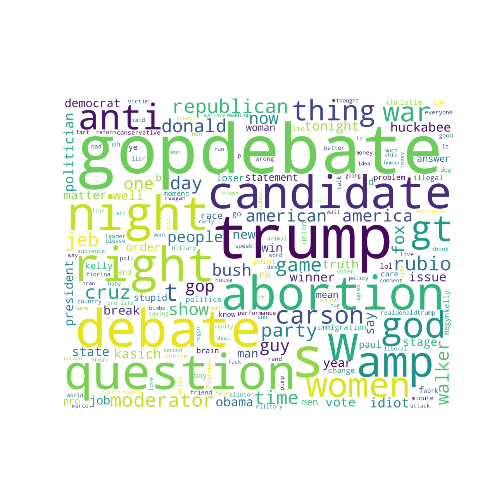

# NLTK Sentiment Analysis Wordcloud

The purpose of this project is to demonstrate Sentiment Analysis using Natural Language Toolkit by visualizing data in wordcloud.

## Installation Guidelines


- Clone the repository


- Create virtual environment:

    ```
    pip install virtualenv
    ```
    
    ```
    virtualenv -p python3.6 venv
    ```

- Activate the virtual environment:
  
    ```
    source venv/bin/activate
    ```

- Activate the virtual environment:

    ```
    source mybot/venv/bin/activate
    ```
-  Install dependencies:
    
    ```
    pip install -r requirements.txt
    ```
   

***   

#### Wordcloud image for positive words:


#### Wordcloud image for negative words:


#### Wordcloud image for word features:




***

Inspired by:

`https://www.kaggle.com/ngyptr/python-nltk-sentiment-analysis/data`
